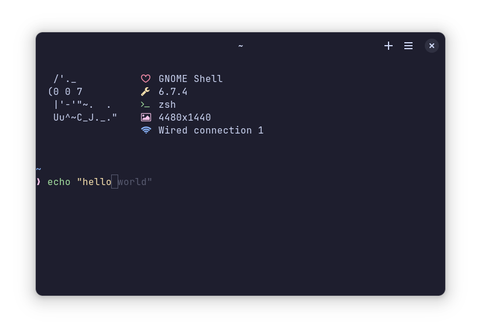
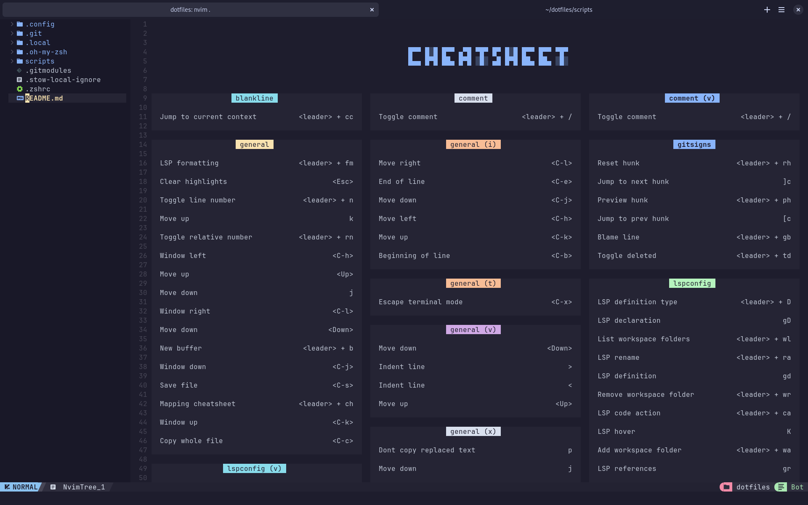

# Kalitsune's .dotfiles

## What are dotfiles?
Dotfiles are configuration files on Unix-like systems that are typically hidden and prefixed with a dot (e.g., .bashrc, .vimrc). These files store settings and preferences for various command-line tools, text editors, and other applications, allowing users to customize their environment to suit their needs.

The cool part is that because they're files I can share them with you :D


## Setup
This repository is intended to be used with [GNU Stow](https://www.gnu.org/software/stow/), you can check [this video](https://www.youtube.com/watch?v=y6XCebnB9gs) to learn more about how it works.

### Dependencies
To use this repository you'll need `git` and `stow` otherwise it will depend on which dotfiles you're looking for.

### Installation
Depending on what you want to install you might need to install a few more things,
I provided config scripts in the [scripts](./scripts/) directory to allow for an easier installation.

You can install the dotfiles either by coying them manually or by runnig `stow .` in the root directory of this repository.

it is however recommended that you use the [install-all.sh](./scripts/install-all.sh) script from the [scripts](./scripts/) directory if possible because it'll also install the dependencies
just run:
```sh
./scripts/install-all.sh
```
## Screens
### Terminal

### Editor


